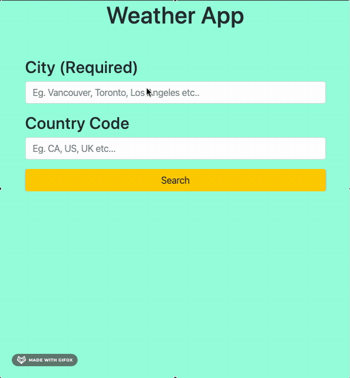

# Weather App

## About the App

    A simple weather app that displays the weather of searched city.
    It is server side rendered built with NodeJS,
    Express and EJS. OpenWeather API was used to fetch data.

## Run app

    1. Rename envSAMPLE to .env
    2. Inside .env , insert your API KEY
    3. Run `$ API_KEY={api key} node index.js` in your terminal
    4. Open localhost:5000 in your browser
    5. Enjoy

## App Preview

